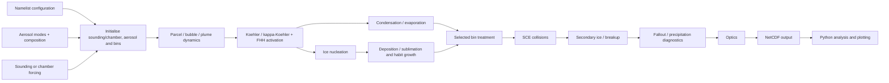

# Bin Microphysics Model (BMM)

BMM is a sectional cloud microphysics model for process studies of aerosol activation, warm-cloud growth, mixed-phase and ice microphysics, particle collisions, secondary ice production, sedimentation/fallout and optical properties. The model can be run as an atmospheric parcel/bubble/plume calculation or driven by prescribed chamber time series, with a standalone stochastic collection equation (SCE) model also provided.

The code is written primarily in Fortran and writes NetCDF output. Python scripts in `python/` provide plotting, parameterisation tests and experiment-specific analysis workflows.

> **Development status**
>
> BMM is an actively developed research model. The root `namelist.in` is the standard configuration; alternative general-purpose configurations are in `configs/`, while experiment-specific namelists are kept alongside their Python analysis workflows.

## Contents

- [Model overview](#model-overview)
- [Scientific capabilities](#scientific-capabilities)
- [Model architecture](#model-architecture)
- [Aerosol, activation and liquid water](#aerosol-activation-and-liquid-water)
- [Ice microphysics](#ice-microphysics)
- [Collisions and secondary ice](#collisions-and-secondary-ice)
- [Bin representations](#bin-representations)
- [Parcel, plume and chamber configurations](#parcel-plume-and-chamber-configurations)
- [Sedimentation, precipitation and optics](#sedimentation-precipitation-and-optics)
- [Building the model](#building-the-model)
- [Running the model](#running-the-model)
- [Configuration files](#configuration-files)
- [NetCDF output](#netcdf-output)
- [Python analysis](#python-analysis)
- [Showcase figures](#showcase-figures)
- [Repository layout](#repository-layout)
- [Known limitations and development notes](#known-limitations-and-development-notes)
- [Selected references](#selected-references)

---

## Model overview

BMM follows aerosol-containing particles through changes in water content and phase while retaining aerosol composition. Aerosol can therefore remain associated with liquid or frozen hydrometeors through condensation, evaporation, freezing, melting, deposition, sublimation and collisions.

The main model supports:

- multiple externally mixed aerosol modes;
- multiple lognormal submodes within each external mode;
- multiple nonvolatile composition components within a particle;
- molecular/Raoult or kappa-Koehler hygroscopic growth;
- FHH adsorption growth for adsorbing components;
- explicit activation from the current Koehler/FHH critical point;
- liquid condensation and evaporation;
- ice nucleation, deposition/sublimation and habit evolution;
- stochastic collection between liquid and/or ice particles;
- secondary ice production and collisional breakup options;
- several sectional/bin representations;
- entraining bubble or plume/jet dynamics, prescribed updrafts, or chamber forcing;
- optional residence-time fallout;
- geometric or anomalous-diffraction-theory optical properties.

The code is intended primarily as a detailed process model and numerical test bed rather than a bulk microphysics scheme.

## Scientific capabilities

| Area | Implemented treatments |
|---|---|
| Aerosol population | External modes, internal lognormal submodes, component mass fractions |
| Hygroscopic growth | Molecular/Raoult Koehler or kappa-Koehler |
| Adsorption | FHH adsorption for components with non-zero `afhh_core1`/`bfhh_core1` |
| Activation | Critical point of the current Koehler/FHH equilibrium curve |
| Warm microphysics | Condensation and evaporation with coupled parcel thermodynamics |
| Ice nucleation | Koop homogeneous; discrete INAS immersion; DeMott; Daily/DCMEX |
| INAS materials | Niemand desert dust; Murray kaolinite; Atkinson K-feldspar |
| Ice growth | Vapour deposition/sublimation, capacitance, density/aspect-ratio moments |
| Collisions | Stochastic collection equation (SCE) |
| Secondary ice | Hallett-Mossop, model mode-1/mode-2 options, collisional breakup |
| Breakup | Vardiman or Phillips-style breakup options |
| Bin numerics | Fully moving, moving-centre, Chen-Lamb mass-conserving remapping |
| Dynamics | Prescribed updraft, stopped/oscillatory updraft, entraining bubble or plume/jet |
| Chamber mode | Prescribed pressure, temperature and total-water time series |
| Sedimentation | Optional residence-time fallout plus precipitation-flux diagnostics |
| Optics | Geometric `Qext=2` approximation or anomalous diffraction theory (ADT) |
| Output | NetCDF time series and sectional particle fields |

## Model architecture



A key design feature is that particle number, aerosol component masses and ice-property moments are carried together through remapping and collection. Some moments are extensive, some are number-weighted properties, and INAS threshold moments use a special inheritance rule during physical collisions.

## Aerosol, activation and liquid water

### Aerosol representation

The initial aerosol is described with `n_mode` externally mixed modes. Each mode can contain `n_intern` lognormal submodes, specified with:

- `n_aer1`: number concentration [m\(^{-3}\)];
- `d_aer1`: number-median dry diameter [m];
- `sig_aer1`: \(\ln(\sigma_g)\);
- `mass_frac_aer1`: dry component mass fractions.

Component properties are defined by `molw_core1`, `density_core1`, `nu_core1`, `kappa_core1`, and optional FHH/INP properties.

### Koehler treatments

`kappa_flag` selects the activity treatment:

- `0`: molecular/Raoult Koehler treatment using component molecular properties and effective dissociation numbers;
- `1`: kappa-Koehler treatment using component hygroscopicity `kappa_core1`.

FHH adsorption is applied to either formulation when a component has `afhh_core1 > 0` and `bfhh_core1 > 0`.

### FHH adsorption

Adsorbing components can take up water below conventional cloud activation. The FHH contribution is combined using the model's mixed-particle surface-area treatment. A component with `afhh_core1 = 0` makes no adsorption contribution.

The model distinguishes adsorption-grown haze from activated cloud droplets using the critical point of the combined Koehler/FHH equilibrium curve.

### Activation

A particle is diagnosed as activated when its current liquid-water mass exceeds the critical water mass at the maximum of its current Koehler/FHH curve. The same activation criterion is used by the cloud-droplet diagnostic and by heterogeneous immersion-freezing schemes.

This means that the mere presence of adsorbed water does **not** make a particle eligible for immersion freezing.

## Ice microphysics

Ice microphysics is enabled with:

```fortran
ice_flag = 1
```

### Ice nucleation mechanisms

`ice_nucleation_mech(1:4)` controls four mechanisms:

1. **Koop** homogeneous freezing;
2. **INAS** discrete ice-active-site immersion freezing;
3. **DeMott** aerosol-number-based heterogeneous freezing;
4. **Daily/DCMEX** temperature-dependent primary-ice parameterisation.

For a single internally mixed particle population, enabled heterogeneous treatments use the precedence:

```text
INAS > DeMott > Daily
```

so the same population is not independently nucleated by multiple empirical heterogeneous schemes.

INAS, DeMott and Daily are presently restricted to particles that are already activated. Koop is not subject to this activation gate.

### Discrete INAS representation

Rather than evaluating an `ns(T)` probability repeatedly each timestep, fresh aerosol populations are mapped to a small number of cumulative intrinsic freezing-threshold moments, `Nin`.

A typical eight-threshold configuration is:

```fortran
n_inp_classes = 8
inp_temp = -5.15, -8.70, -12.25, -15.80, &
           -19.35, -22.90, -26.45, -30.00
```

The thresholds are common to all components. The **number assigned to each threshold** depends on the selected component INAS parameterisation and its surface area.

Supported component categories include:

```text
none
niemand12
kaolinite_murray11
kfeldspar_atkinson13
demott
daily25
```

The INAS categories currently correspond to:

- `niemand12`: natural desert dust surface-site-density parameterisation;
- `kaolinite_murray11`: kaolinite immersion-freezing treatment;
- `kfeldspar_atkinson13`: K-feldspar treatment.

The `Nin` spectrum is prognostic after creation. It is transported through phase changes and numerical remapping rather than recalculated from the current composition after every collision.

### INAS inheritance during collisions

For a cumulative INAS class with active fractions \(F_1\) and \(F_2\) in the two parent populations, a collision product is active by that threshold if either parent carried such an active site:

\[
F_{\mathrm{new}} = 1-(1-F_1)(1-F_2).
\]

This is represented by the special `MOMENT_INHERIT` moment type in the SCE code.

### DeMott provenance

An extensive `n_demott` moment tracks the number of currently frozen primary DeMott monomers through aggregation. This avoids attempting to reconstruct DeMott provenance solely from the present mixed aerosol composition.

DeMott eligibility still uses the current aerosol population and requires:

- a DeMott-eligible composition;
- no enabled higher-priority INAS treatment for that population;
- dry particle diameter greater than 0.5 µm;
- activation as a liquid particle.

### Ice habit and growth

Ice particles carry additional prognostic moments for shape and aggregation state, including quantities used to reconstruct:

- aspect ratio (`phi`);
- monomer number (`nmon`);
- effective ice volume/density;
- rime mass;
- unrimed/depositional mass information.

Depositional growth uses capacitance, ventilation and kinetic/thermal corrections. The code contains Chen-Lamb-based habit/growth machinery and updates terminal velocities as particle mass and shape evolve.

## Collisions and secondary ice

`sce_flag` controls stochastic collection:

- `0`: no SCE collection;
- `1`: SCE collection;
- `2`: SCE collection plus configured secondary-ice processes.

The SCE operates on an ordered sectional grid and carries aerosol composition and microphysical moments into collision products.

Secondary-ice options include:

- `hm_flag`: Hallett-Mossop rime splintering;
- `break_flag=1`: Vardiman breakup treatment;
- `break_flag=2`: Phillips-style collisional breakup;
- `mode1_flag`: mode-1 fragmentation/freezing treatment;
- `mode2_flag`: mode-2 secondary-ice treatment.

## Bin representations

`bin_scheme_flag` selects the numerical treatment of particle mass during diffusional growth:

| Value | Scheme | Description |
|---:|---|---|
| `0` | Fully moving | Representative particle masses move continuously with condensational/depositional growth |
| `1` | Moving centre | Uses a fixed sectional grid with moving-centre-style redistribution |
| `2` | Chen-Lamb | Mass-conserving remapping to the fixed sectional grid |

When SCE is enabled, a common ordered sectional grid is required before collection. The model therefore projects a fully moving state onto the SCE grid before evaluating collisions.

The standalone SCE grid uses `kfac` to set its cloud-range mass resolution: successive bin masses differ by \(2^{1/kfac}\), so `kfac` is the number of bins per mass doubling.

## Parcel, plume and chamber configurations

### Atmospheric parcel and updraft forcing

`updraft_type` currently supports:

- `1`: prescribed `winit`;
- `2`: `winit` until `t_thresh`, then zero;
- `3`: `winit` until `t_thresh`, followed by cosine oscillation using `winit2` and `amplitude2`;
- `4`: prognostic buoyant/entraining motion.

### Bubble versus plume/jet

`bubble_flag` determines the parcel geometry used by the entrainment/dynamics calculations:

```text
.true.  -> bubble
.false. -> plume / jet
```

`radinit` is interpreted as the corresponding initial bubble or plume/jet radius.

### Adiabatic and entraining calculations

`adiabatic_prof=.true.` disables entrainment and uses an adiabatic parcel-style environment. When false, the model can use lateral or vertical entrainment and supports homogeneous/inhomogeneous mixing options.

`use_prof_for_tprh=.true.` currently initialises **temperature and pressure** from the sounding. Sounding RH is still read and retained, but the initial parcel RH is deliberately set by `rhinit`.

### Chamber forcing

With `chamber_override=.true.`, the model uses prescribed chamber time series for:

- pressure;
- temperature;
- total water.

`chamber_inhom` partitions prescribed chamber water loss between homogeneous vapour/water adjustment and an inhomogeneous particle-number-loss treatment.

This mode supports experiment-specific workflows under `python/aida_analysis/` and `python/MICC_analysis/`.

## Sedimentation, precipitation and optics

### Fallout

With `fallout_flag=.true.`, BMM treats the parcel as a well-mixed volume of vertical depth `residence_depth`. A residence-time sink based on terminal fall velocity is applied to liquid and ice populations.

The model also writes precipitation and cumulative fallout diagnostics.

### Optical properties

With `use_adt_optics=.true.`, extinction and absorption are calculated using anomalous diffraction theory at `optics_wavelength` with refractive-index lookup routines in `opt/`.

With ADT disabled, the original geometric-optics approximation uses `Qext = 2` and zero absorption.

## Building the model

### Requirements

The main executable requires:

- a Fortran compiler (the supplied Makefiles use `gfortran` by default);
- NetCDF C and NetCDF-Fortran libraries/modules;
- standard Unix build tools (`make`, `ar`, `ranlib`).

Python analysis scripts commonly require:

- Python 3;
- NumPy;
- Matplotlib;
- `netCDF4` for reading BMM output;
- additional packages for some experiment-specific workflows.

### NetCDF paths

The top-level `Makefile` uses:

```make
NETCDF_FOR
NETCDF_C
NETCDF_LIB
```

Set the paths for your installation, for example via environment variables or directly in the Makefile. `NETCDF_FOR` must provide the Fortran module/include files; `NETCDF_C` and `NETCDF_FOR` provide the library search paths.

For a standard NetCDF-Fortran installation:

```bash
export NETCDF_FOR=/path/to/netcdf-fortran-prefix
export NETCDF_C=/path/to/netcdf-c-prefix
```

The supplied default linker flag is:

```make
NETCDF_LIB=-lnetcdff
```

If your installation requires additional NetCDF C linkage, adjust the linker flags for your system.

### Compile

```bash
make -j4
```

The normal build produces:

```text
main.exe
```

A development build with bounds checking and floating-point traps is available with:

```bash
make debug
```

Clean all generated Fortran build products with:

```bash
make cleanall
```

### Doxygen

Source-level Doxygen documentation can be generated with:

```bash
doxygen fortran.dxg
```

and opened from the generated HTML output directory.

## Running the model

Run the main model with a namelist path:

```bash
./main.exe namelist.in
```

or, for an alternative configuration:

```bash
./main.exe configs/namelist_inp_example.in
```

The NetCDF output path is controlled by `outputfile` in `run_vars`.

The standalone SCE model under `sce/` has its own driver and namelist.

## Configuration files

The root configuration is:

```text
namelist.in
```

General alternatives are in:

```text
configs/
```

including examples for FHH adsorption, explicit INAS and Daily/DCMEX ice nucleation.

Experiment-specific configurations are deliberately kept with the workflows that use them, for example:

```text
python/aida_analysis/
python/MICC_analysis/
python/cloud_seeding/
```

Every active namelist variable is documented immediately above its assignment with `!>` comments describing its purpose, units, options and relevant interactions.

### Main namelist groups

| Group | Purpose |
|---|---|
| `run_vars` | Integration, dynamics, phase/microphysics switches, entrainment, optics and fallout |
| `aerosol_setup` | Aerosol/component/bin dimensions |
| `sounding_spec` | Atmospheric environmental profile |
| `aerosol_spec` | Aerosol PSD, composition, hygroscopicity, FHH and INP categories |
| `chamber_spec` | Time-dependent chamber pressure, temperature and total water |
| `cloud_setup` | Standalone/fixed SCE cloud-range grid |
| `cloud_spec` | Initial standalone-SCE cloud/ice populations |

## NetCDF output

The precise set of variables depends on enabled physics. Key outputs include:

### Parcel/environment

- `time`: model time;
- `z`: parcel height;
- `p`: pressure;
- `t`: temperature;
- `rh`: liquid-water relative humidity;
- `w`: vertical velocity;
- `rad_par`: bubble/plume radius for entraining runs.

### Liquid

- `ql`: liquid-water mixing ratio;
- `ndrop`: activated cloud-droplet number;
- `deff`: effective droplet diameter;
- `mwat`: water mass per liquid bin;
- `nwat`: liquid particle number by bin;
- `maer`: aerosol component masses carried by liquid particles.

### Ice

When `ice_flag=1`:

- `qi`: ice-water mixing ratio;
- `nice`: ice number concentration;
- `mice`: ice mass by bin;
- `nicem`: ice number by bin;
- `phi`: ice aspect-ratio information;
- `nmon`: monomer number/aggregation state;
- `rhoi`: effective ice density;
- `maeri`: aerosol component masses carried by ice particles.

### Optical/fallout diagnostics

- `beta_ext`: extinction coefficient;
- `precip`: precipitation-flux diagnostic;
- `qfall_liq`, `qfall_ice`: cumulative fallout mass;
- `nfall_liq`, `nfall_ice`: cumulative fallout number;
- `fallrate_liq`, `fallrate_ice`: timestep fallout-rate diagnostics.

The grid edges are also written as `mbinedges` for reconstructing sectional distributions.

## Python analysis

The `python/` directory contains both general examples and experiment-specific research workflows.

Useful starting points include:

```text
python/example_plot_bmm.py
python/example_plot_bmm2.py
python/example_plot_bmm3.py
python/example_PSD_bmm.py
python/example_PSD_bmm2.py
```

These demonstrate reading the NetCDF output and plotting parcel state, liquid/ice mixing ratios, number concentrations and sectional particle distributions.

Additional directories contain AIDA, MICC/REFLECT, DCMEX, marine-cloud-brightening, cloud-seeding and other analysis workflows. Some of these scripts expect experiment-specific data that are not distributed with the core model.

## Showcase figures

Model-output figures will be added under:

```text
docs/figures/
```

These showcase panels will be documented in [`docs/figures/README.md`](docs/figures/README.md).

A strong README gallery would eventually include, for example:

1. **Parcel evolution:** temperature, RH, liquid/ice water and vertical velocity;
2. **Sectional evolution:** liquid and ice size distributions versus time/temperature;
3. **Ice habit:** aspect ratio, effective density and monomer number as crystals grow;
4. **Primary ice:** comparison of K-feldspar, desert dust, kaolinite, DeMott and Daily/DCMEX cases;
5. **Secondary ice:** an example showing primary ice followed by Hallett-Mossop or breakup multiplication;
6. **Optics:** extinction response to changes in droplet/ice populations.

When figures are available, they can be embedded directly, for example:

```markdown

```

## Repository layout

```text
.
├── bin_microphysics_module.f90   # Main BMM physics, numerics and NetCDF I/O
├── main.f90                      # Main executable driver
├── namelist.in                   # Standard configuration
├── configs/                      # General alternative/example configurations
├── sce/                          # Standalone SCE and collection/SIP implementation
├── osnf/                         # Numerical support library
├── opt/                          # Refractive indices and ADT optics
├── python/                       # Plotting and experiment-specific analysis
├── docs/figures/                 # Optional README/showcase figures
└── Makefile
```

## Known limitations and development notes

The following are intentional current-state notes rather than hidden behaviour:

- `microphysics_flag` is a legacy/reserved input and currently does not bypass the BMM driver.
- `sv_flag` and the semivolatile-organic arrays are retained in the interface but are not presently active in the BMM microphysics.
- Daily/DCMEX primary-ice provenance is inferred approximately after mixed-mechanism aggregation; unlike DeMott, there is currently no dedicated `n_daily` provenance moment.
- The explicit INAS representation discretises continuous active-site spectra into a configurable number of common temperature thresholds.
- INAS component surface area for a fresh internally mixed population is represented using the model's component geometric-area closure rather than an explicitly resolved exposed mineral surface.
- Heterogeneous immersion schemes are currently gated by cloud activation; adsorbed haze water alone does not activate them.
- Several historical Python workflows use hard-coded paths or expect external campaign data and may need local configuration before use.

## Selected references

The model combines and tests ideas from a broad cloud-microphysics literature. Particularly relevant references for currently implemented options include:

- Chen, J.-P. and Lamb, D. (1994), *The Theoretical Basis for the Parameterization of Ice Crystal Habits: Growth by Vapor Deposition*, Journal of the Atmospheric Sciences, 51, 1206–1222. https://doi.org/10.1175/1520-0469(1994)051%3C1206:TTBFTP%3E2.0.CO;2
- Koop, T., Luo, B., Tsias, A. and Peter, T. (2000), *Water activity as the determinant for homogeneous ice nucleation in aqueous solutions*, Nature, 406, 611–614. https://doi.org/10.1038/35020537
- DeMott, P. J. et al. (2010), *Predicting global atmospheric ice nuclei distributions and their impacts on climate*, PNAS, 107, 11217–11222. https://doi.org/10.1073/pnas.0910818107
- Murray, B. J. et al. (2011), *Heterogeneous freezing of water droplets containing kaolinite particles*, Atmospheric Chemistry and Physics, 11, 4191–4207. https://doi.org/10.5194/acp-11-4191-2011
- Niemand, M. et al. (2012), *A Particle-Surface-Area-Based Parameterization of Immersion Freezing on Desert Dust Particles*, Journal of the Atmospheric Sciences, 69, 3077–3092. https://doi.org/10.1175/JAS-D-11-0249.1
- Atkinson, J. D. et al. (2013), *The importance of feldspar for ice nucleation by mineral dust in mixed-phase clouds*, Nature, 498, 355–358. https://doi.org/10.1038/nature12278
- Finney, D. L. et al. (2025), *Microphysical fingerprints in anvil cloud albedo*, Atmospheric Chemistry and Physics, 25, 10907–10929. https://doi.org/10.5194/acp-25-10907-2025 — includes discussion of the DCMEX/Daily INP formulation used by the current model option.

For secondary-ice and breakup options, see the source-code documentation adjacent to the relevant SCE/SIP routines; those implementations retain their literature-specific comments and parameterisation names.

---

## Contributing and development

This is a research codebase. Changes to numerical conservation, aerosol-component bookkeeping, INP inheritance, ice moments or SCE product mapping should be tested with runtime checking before being accepted.

A useful development build is:

```bash
make debug
```

For changes to namelist interfaces, update the comments in **all** active example/experiment configurations or preserve a backwards-compatible default in the reader.
